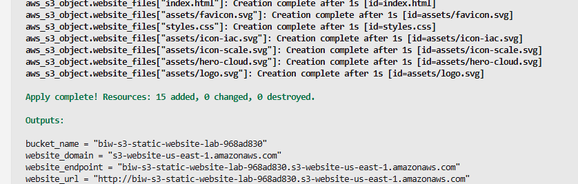
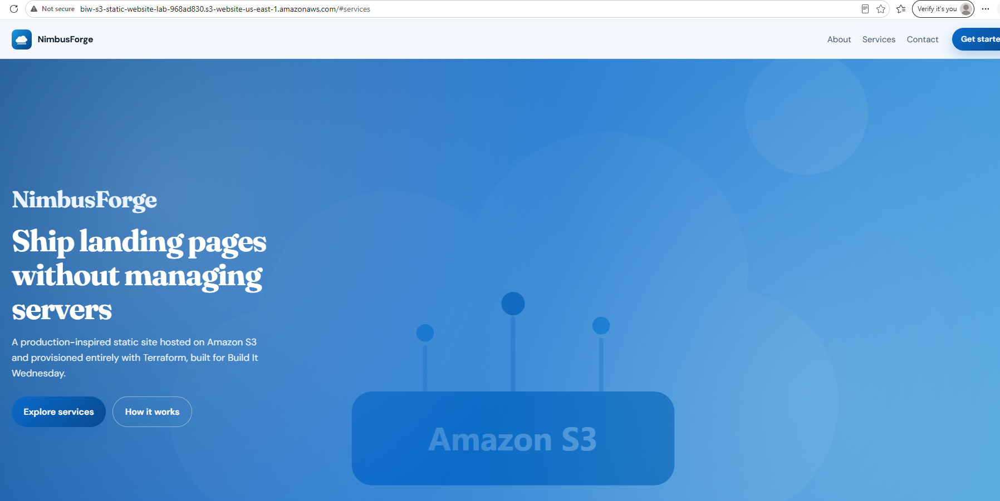
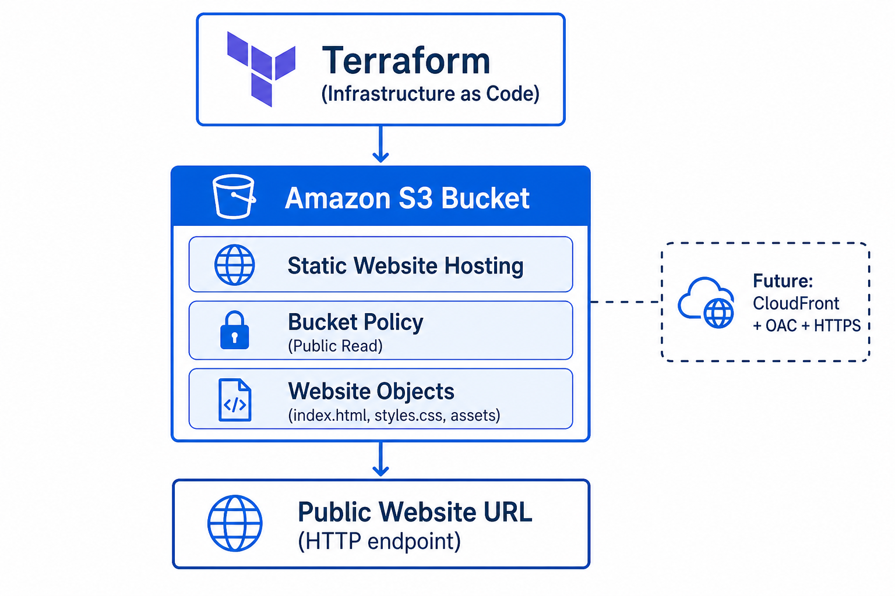
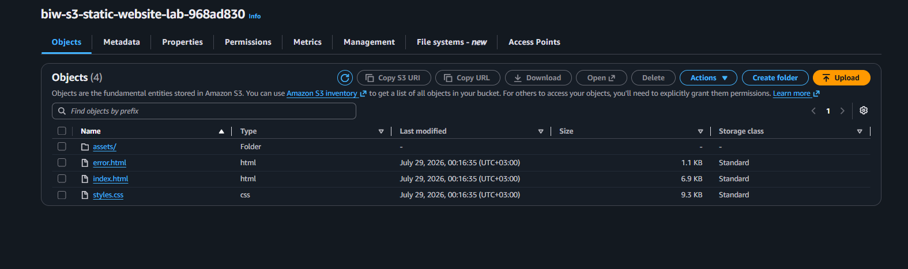
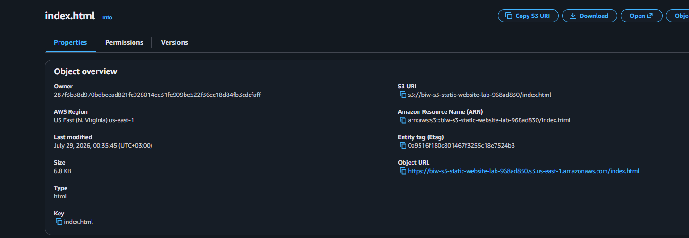
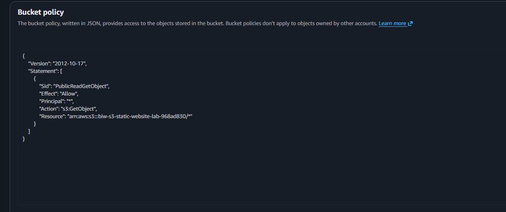

# Host a Static Website on Amazon S3 Using Terraform

**Build It Wednesday** · Beginner-friendly · Infrastructure as Code

Deploy a simple website on **Amazon S3** using **Terraform**. No servers. No AWS Console clicks after setup. Follow this guide from zero to a live website URL.

---

## What you will build

By the end of this project you will have:

1. An Amazon S3 bucket
2. Static website hosting enabled (`index.html` + `error.html`)
3. A public-read bucket policy (only `s3:GetObject`)
4. Your website files uploaded as S3 objects
5. A public website URL printed by Terraform

**Example result after `terraform apply`:**



**Live homepage served from S3:**



---

## Business scenario (why this architecture)

A small startup wants a landing page without managing servers.

They choose **Amazon S3 Static Website Hosting** because it is:

- Low cost
- Highly durable
- Fully managed
- Easy to maintain
- Serverless

Terraform provisions everything as code so the setup is repeatable and easy to clean up.

---

## Architecture



**Flow:**

1. You run Terraform with your AWS credentials (IAM)
2. Terraform creates the S3 bucket and website settings
3. Terraform uploads `website/` files as objects
4. Visitors open the S3 website endpoint URL in a browser

> **Production tip (future):** Add CloudFront + Origin Access Control (OAC) for HTTPS and a private bucket. This beginner lab uses the classic public S3 website endpoint on purpose.

---

## Concepts you will learn

| Concept | Simple meaning |
| --- | --- |
| **Bucket** | Container that stores files |
| **Object** | A file stored in S3 |
| **Object key** | The file path/name in S3 (example: `assets/logo.svg`) |
| **Prefix** | The “folder” part of a key (example: `assets/`) |
| **Static Website Hosting** | S3 serves HTML/CSS/images like a simple website |
| **Bucket policy** | Rules that say who can read/write objects |
| **Terraform provider** | Plugin that talks to AWS |
| **Terraform resource** | One piece of infrastructure you declare |
| **Terraform output** | Values printed after apply (like the website URL) |

---

## Project structure

```text
build-it-wednesday-s3/
├── README.md                 ← you are here
├── architecture/
│   └── architecture-diagram.png
├── screenshots/              ← proof of a successful deployment
├── website/                  ← the HTML/CSS site Terraform uploads
│   ├── index.html
│   ├── error.html
│   ├── styles.css
│   └── assets/
└── terraform/                ← Infrastructure as Code
    ├── versions.tf
    ├── providers.tf
    ├── variables.tf
    ├── main.tf
    ├── outputs.tf
    └── terraform.tfvars.example
```

---

## Prerequisites (do this once)

### 1) AWS account

Create a free AWS account if you do not have one.

### 2) Install AWS CLI

Install from: https://aws.amazon.com/cli/

Configure credentials:

```bash
aws configure
```

Enter:

- AWS Access Key ID
- AWS Secret Access Key
- Default region (example: `us-east-1`)
- Output format: `json`

Verify:

```bash
aws sts get-caller-identity
```

You should see your Account and UserId. If this fails, fix credentials before continuing.

### 3) Install Terraform

Install Terraform **1.5+** from: https://developer.hashicorp.com/terraform/install

Verify:

```bash
terraform version
```

### 4) Clone this repository

```bash
git clone https://github.com/Bel-94/build-it-wednesday-s3.git
cd build-it-wednesday-s3
```

---

## Step-by-step deployment

Work in a terminal. Every command below is intentional — read the “Why” notes.

### Step 1 — Go into the Terraform folder

```bash
cd terraform
```

**Why:** All `.tf` files live here. Terraform commands must run from this directory.

### Step 2 — Create your variable file (optional)

```bash
cp terraform.tfvars.example terraform.tfvars
```

On Windows PowerShell:

```powershell
Copy-Item terraform.tfvars.example terraform.tfvars
```

Open `terraform.tfvars` if you want to change the region.  
If you leave `bucket_name` unset, Terraform creates a unique name automatically.

**Why:** S3 bucket names are globally unique. Auto-naming avoids collisions between learners.

### Step 3 — Initialize Terraform

```bash
terraform init
```

**Why:** Downloads the AWS and Random providers into `.terraform/`. Run this once on a new machine (or after provider changes).

Expected result: `Terraform has been successfully initialized!`

### Step 4 — Preview the plan

```bash
terraform plan
```

**Why:** Shows what Terraform will create **without changing AWS yet**. Always review the plan.

You should see resources such as:

- `aws_s3_bucket.website`
- `aws_s3_bucket_public_access_block.website`
- `aws_s3_bucket_website_configuration.website`
- `aws_s3_bucket_policy.website`
- `aws_s3_object.website_files[...]`

### Step 5 — Apply (create the website in AWS)

```bash
terraform apply
```

Type `yes` when asked.

**Why:** This creates the real AWS resources and uploads the website files.

When it finishes, you should see outputs like:


Copy your `website_url` value.

### Step 6 — Open the website

Paste the URL into your browser (it starts with `http://`).

Example:

```text
http://YOUR-BUCKET-NAME.s3-website-us-east-1.amazonaws.com
```

You should see the NimbusForge landing page:


> Note: The S3 website endpoint is **HTTP only**. HTTPS is a CloudFront improvement for later.

---

## Verification checklist

Use this to confirm everything worked.

### A) Confirm objects were uploaded

AWS Console → S3 → open your bucket → Objects

You should see files like `index.html`, `styles.css`, and an `assets/` prefix:



Object overview example:



Or use CLI:

```bash
aws s3 ls s3://YOUR-BUCKET-NAME --recursive
```

### B) Confirm the bucket policy allows public reads

In the Console, open **Permissions → Bucket policy**.  
You should see public `s3:GetObject` (read-only), not write/admin permissions:



### C) Confirm website hosting settings

```bash
aws s3api get-bucket-website --bucket YOUR-BUCKET-NAME
```

Expect:

- Index document: `index.html`
- Error document: `error.html`

### D) Re-print outputs anytime

```bash
terraform output
terraform output -raw website_url
```

| Output | Meaning |
| --- | --- |
| `bucket_name` | Your S3 bucket name |
| `website_endpoint` | Website hostname |
| `website_domain` | Website domain |
| `website_url` | Ready-to-open URL |

---

## Updating the website later

1. Edit files under `website/`
2. **Save the files** (`Ctrl+S`)
3. From `terraform/`, run:

```bash
terraform apply
```

Terraform detects file changes (via checksum) and re-uploads updated objects.

---

## Cleanup (important)

When you finish the lab, destroy the resources so you do not keep paying for storage:

```bash
cd terraform
terraform destroy
```

Type `yes`.

**Why cleanup matters:** Good cloud hygiene. Labs should not linger in accounts forever.

---

## Why Block Public Access is adjusted (read this)

By default, AWS blocks public access to new buckets. That is a strong security default.

For **classic S3 Static Website Hosting** (this lab), browsers need to download objects anonymously. So Terraform intentionally allows a public bucket policy.

**Security lesson:**

- This lab path: public read via bucket policy + website endpoint
- Production path: private bucket + CloudFront + Origin Access Control + HTTPS

The policy still follows least privilege: only `s3:GetObject` on objects. No public write.

---

## AWS Well-Architected notes (interview talking points)

### Operational Excellence
Terraform makes the setup repeatable. `plan` before `apply` reduces surprises.

### Security
Public read is required for this beginner pattern. Production should use CloudFront + OAC and keep the bucket private.

### Reliability
S3 is designed for extremely high durability. No web server process to crash for static files.

### Performance Efficiency
S3 serves static content efficiently. Add CloudFront later for edge caching.

### Cost Optimization
Pay for storage and requests. No always-on EC2. Destroy labs when done.

### Sustainability
Serverless static hosting avoids idle virtual machines for a simple brochure site.

---

## Trade-offs

**Pros**

- Simple
- Cheap
- Scalable
- Durable
- Fully Terraform-managed

**Cons**

- Public bucket required for this pattern
- No backend/app logic
- No HTTPS on the S3 website endpoint by default

**Future improvements**

- Amazon CloudFront
- Origin Access Control (OAC)
- ACM (TLS certificates)
- Route 53 (custom domain)
- GitHub Actions CI/CD

---

## Lessons learned

After this project, you should be able to explain:

1. What an S3 bucket, object, key, and prefix are
2. How Static Website Hosting works
3. Why Block Public Access defaults exist
4. How a least-privilege public-read policy works
5. Why Terraform providers, resources, variables, and outputs matter
6. Why Infrastructure as Code beats click-ops for labs and portfolios
7. What you would change for production (CloudFront + OAC + HTTPS)

---

## Troubleshooting

| Problem | Fix |
| --- | --- |
| `AccessDenied` on apply | Your IAM user/role needs S3 permissions |
| Bucket name already exists | Leave `bucket_name` unset so Terraform generates a unique name |
| Website shows old content | Hard refresh with `Ctrl+F5`, or re-run `terraform apply` after saving files |
| `terraform` command not found | Re-open the terminal after installing Terraform, or fix PATH |
| AWS CLI not authenticated | Run `aws configure` and test with `aws sts get-caller-identity` |

---

## Quick command cheat sheet

```bash
git clone https://github.com/Bel-94/build-it-wednesday-s3.git
cd build-it-wednesday-s3/terraform
cp terraform.tfvars.example terraform.tfvars   # optional
terraform init
terraform plan
terraform apply
terraform output -raw website_url
terraform destroy                              # when finished
```

---

## License / disclaimer

Educational project for **Build It Wednesday**.  
Not affiliated with Amazon Web Services. Use in AWS accounts you own, and clean up resources you no longer need.
